# 15.AWS-CLOUD-SOLUTION-FOR-2-COMPANY-WEBSITES-USING-A-REVERSE-PROXY-TECHNOLOGY

We will build a secure infrastructure inside AWS VPC (Virtual Private Cloud) network for **ACS** Company that uses WordPress CMS for its main business website, and a [Tooling](https://github.com/Olaminiyi/tooling) website for the DevOps team.

As part of the company’s desire for improved security and performance, a decision has been made to use a reverse proxy technology from **NGINX** to achieve this.

**PURPOSE:**

Reduced Cost, increase Security and Scalability are the major requirements for this project. Hence, implementing the architecture designed below, ensure that infrastructure for both websites (WordPress and Tooling) are resilient to Web Server failures, can accomodate increased traffic and at the same time, has reasonable cost.

**AWS resources Required for the Design:**

- North Virginia Region (us-east-1)
- Availibility zones (3 subnets in us-east-1a) and (3 subnets in us-east-1b)
- VPC Network Range - 10.0.0.0/16
- subnets - 10.0.1.0/24, 10.0.2.0/24, 10.0.3.0/24, 10.0.4.0/24, 10.0.5.0/24 and 10.0.6.0/24
- 6 subnets (4 private subnets and 2 public subnets)
- internet gateway
- 2 nginx for reverse proxy
- 2 bastion hosts/jump servers
- 2 application Load balancers(ALB)
- Auto scaling Groups to manage the scaling of the Ec2 instances
- 2 NAT gateways for the resources in the private subnet to communicate with the internet gateway.

> [!NOTE]
> The NAT gateway only allows traffic to the internet and does not allow from the internet.

- Route DNS
- RDS for the database
- Amazon Elastic Files System for the file management

**AWS MULTIPLE WEBSITE PROJECT**

Firstly fork https://github.com/Olaminiyi/ACS-project-config.git into your repo

### SET UP A VIRTUAL PRIVATE NETWORK (VPC)

**Go to AWS console**
We are creating 2 `route tables`, the First will talk to the public subnet via `internet gateway` WHILE the SECOND will talk to `private subnet` via the `Natgateway`

**Create a new VPC**
Name it ACS-VPC
From the soluton diagram: IPv6 CIDR block : 10.0.0.0/16

We need to enable the DNS hostname, the DNS resolution is enabled already
From actions > edit VPC settings
 

Check enable and save changes
       

    

### Create internet gateway and attach to VPC

Click on the Internet gateway

     
Create, name it ACS-Igw
 

Click on Action > attach to VPC
   

  
Select our own VPC > Attach internet gateway
     

    
### The next thing to create is the Subnet

To divide ip address check: ipinfo.io/ips
Our /16 is under 0/8, were are going to set set even number to public subnet and odd number to private subnet
Click on  creat subnet
From the diagram, there are 2 subnet and 2 availablity zones. the load balancer (ALB) needs two zones to function
For this project, we are using AZ  us-eas-t1a and us-east-1b
select our pvc

Named it ACS-public-subnet-1
select us-east-1a
The CIDR block: 10.0.0.0/24
 

**Add new subnet**
ACS-public-subnet-2
select us-east-1b
10.0.2.0/24
Click on create subnet
 

**For the second subnet**
create the private subnet
select our pvc
ACS-private-subnet-1
us-east-1a
10.0.1.0/24

**Add new subnet**
ACS-private-subnet-2
us-east-1b
10.0.3.0/24

**for the third subnet**
ACS-private-subnet-3
us-east-1a
10.0.5.0/24

**Add new subnet**
ACS-private-subnet-4
us-east-1b
10.0.7.0/24

All created subnets
 

### Next is to create the Route Table

We are creating 2 route table
Click on the route table link
The first one: ACS-public-rtb
Select the VPC > create
 

The second one: ACS-private-rtb
Select the VPC > create
 

### Next is to associate the public subnet to the public route tabe and vice-versa

Click on the ACS-public-rtb
Click on subnet asscoiation > edit subnet associations
 

Select public subnet1 & 2
Click on save association

Do the same for ACS-private-rtb

### Next is to edit the route of the route table

We want the the Route table to have access to the subnets
Click on Route table > Public Route > 
Action > Edit Route 

Click on Add route
Let it have access to the internet by open it to 0.0.0/0
Select INTERNET GATEWAY > select the created internet gateway > save changes

This implies that every subnet associated to this Route Table is going to talk to the internet via this internet gateway
Internet gateway is a 2 way communication; the internet can talk to the subnet and the subnet can talk to the internet
UNLIKE the NATGATEWAY, the subnet can talk internet but the internet can not talk to the subnet

The next step is to create the Natgateway to be attached to the Private subnets but we need to create ELASTIC IP to be attached to the Natgateway first
Click on elastic IP > allocate Elastic IP
 
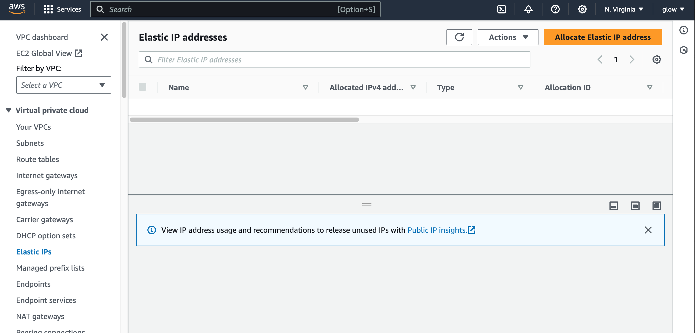
    
Name it ACS-NAT > Allocate

Note that if you allocate an `Elastip IP` without attaching it to a resources you get charged but if you associate to a resources you won't get charged

### Next step is to create NAT Gateway
    
Click on Nat gateway > create a Natgateway

Name it (ACS-natgateway)
Natgate must be placed in PUBLIC
      

Placed it in ACS-public-subnet-1
Placed it in elastic IP created > Create
 

Lets go back to our route table
Rememer we connecting to `NAT GATEWAY` here because it is Private (unlike the public Public route that can communicate 2 ways with internet gateway)
       
Click on Route table > Private Route
Action > Edit Route 
 

Click on Add route
let it have access to the internet by open it to 0.0.0/0
select NAT GATEWAY > select the created Nat gateway > save changes

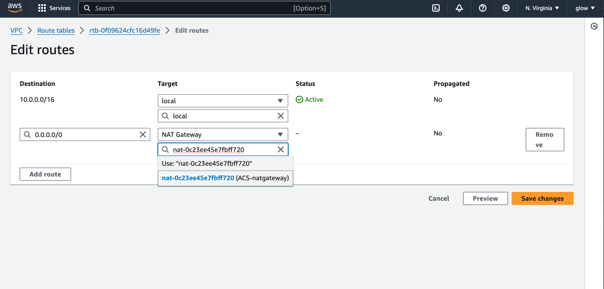

The next step is to create the security group 
we will creat security group for the application load balancer and the resources we have
The first security group is for the external load balancer
Under Security > Security group > create security group

Named it ACS-ext-ALB > Descrip(for ext ALB)
Select the ACS-VPC
 

### EDIT THE INBOUND RULES

For the external ALB, we want it to be accessible on the internet from anywhere
give it both HTTPS and HTTP from anywhere 0.0.0.0/0

**FOR OUTBOUND RULES**
Allow all trafic from 0.0.0.0/0
for tags you can put ACS-ext-ALB 
Create security group
  

        
The next security group is the bastion security group
click security group
Named it ACS-bastion > Descrip(for bastion)
select the ACS-VPC

**EDIT THE INBOUND RULES**
we need ssh for our bastion, and only from our computer IP
open ssh from (sorce = My IP)
add description
that's all we need for bastion > create Security group

### The next security group is for the reverse proxy servers (NGINX servers)
Create security group
named (ACS-nginx-reverse-proxy) > select VPC

 

from the diagram, for the reverse proxy (nginx) is placed directly under the ALB. the source of traffic should only come from the ALB (not from the internet nor our IP)

**EDIT INBOUND RULES**
HTTP from the ALB security group
HTTPS from the ALB security group
we need our bastion to have access to our reverse proxy server in case of any issue, we should be able to ssh into our reverse proxy server from our bastion
SSH from the bastion security group 

**OUTBOUND RULES** is ok for all traffic from 0.0.0.0/0
Create group

The next security group is for the internal load balancer
Under Security > Security group > create security group
Named it ACS-int-ALB > Descrip(for int ALB)
Select the ACS-VPC
 

**EDIT THE INBOUND RULES** 
NOTE from the diagram, the traffic is coming only from the Nginx server
Both HTTPS and HTTP from nginx security group
nothing for the outbound rules 
create security

        
The next security group we are creating now is for the webservers
The source of its traffic is coming only from the internal ALB
Named it ACS-weberver > Descrip(for webserev)
Select the ACS-VPC
 
 

**EDIT INBOUND RULES**

ssh access only via the bastion security group
HTTP and HTTPS from the internal ALB security group
**Create**

        
The next security group we are creating is for the data layer
For the data layer, our webserver needs to be mounts to the Amazon Elastic Filesystem and conneted to the RDS database
Also our bastion needs access to the database
Named it ACS-datalayer > Descrip(for datalayer)
select the ACS-VPC

**EDIT INBOUND RULES**
`mysql` access only via the `baston security group`, we need mysql access into the RDS to create `database`.
`NFS` access through the `webserver security group`
`mysql/aurora` access through the `webserver security group`
Create
     

After creating all the security groups, the next is to create the certificate, the amazon file system and then the RDS

Got a domain name `olami.uk`from 123Reg and transfer it to Route53 on aws

Create a hosted name in the `Route 53` with the registered domain name 
    

**Created hosted zone**
Put the domain name (olami.uk) > choose public hosted zone
 

    
Go to the domain name provider and `edit` the `nameservers`
Transfer the (4 server address) in the hostname zone in the (NS column) to the domain provider nameservers

The next step is to get a certificate from **AWS Certificate Manager**
The reason we are creating a `certificate`first is because when creating `ALB` we need to select a `certificate`
Click on request a Cert > Request public cert > Next
 

 

  
In the domain name, we are going to use a **wild card i.e(*.)**
should in case we want to have another `name` or `subdomain`, the `WILDCARD` will make sure that any name before the domain name is attached to the `certificate`. e.g **temi.olami.uk**

put this for domain name: `*.olami.uk`
chose DNS validation > 
        
 

Key Algorithm : RSA 2048
for name or tags: ACS-cert > Review > confirm

> [!NOTE]
> Because we are using DNS verification is going to automatically write to the Rout53 to confirm
   
click on create records in Route53

> [!NOTE] 
> The verification maybe pending for a while but will be issued after confirmation
  

Certificate will be attched to ALB

### The next service to create is Elastic file system
       
Go to amazon file system service > create file system
name: ACS-filesystem
select PVC

Regional
click on customize > Next

We want to add mount target to our filesystem which simply means specifying the subnet
Any resources in the subnet we specify will be able to mount on the file system 
From the diagram we can se that the webservers that want to ount on the file system and in `private subnet 1 & 2`

If we mistakenly put file system in `private subnet 3 & 4`that means our webserver will not be able to mount on the file system because we have not created `mount target` in their subnet

so chose private subnet 1 for us-east-1a
chose private subnet 2 for us-east-1b

For the security group; chose ACS-datalayer for both > next > create
     

The next thing we are going to create is access point for the file system
Access point is what we specified for servers to mount with
we are creating 2 access point, one for `wordpress` and `Tooling`
we are creating 2 access point so we don't have to mount 2 webservers on a single access point
if we do that, the files will overwrite each other and that will mess up our infrastructure
create Access point under `EFS service`
For file name: choose the already created "ACS-filesytem"
**For the first one; Name : wordpress for tag - wordpree-ap (access point)**
root directory: /wordpress

POSIX user; set it to the root user = 0
Group ID = 0
leave secondary empty

under Root directory creation permission
owner ID = 0
owner group ID = 0
for the POSIX permission, we want our file to be able to read & write
we set to 0755 > create access point

 
            
**for the second one Tooling**
Name tooling
root directory: /tooling

POSIX user; set it to the root user = 0
Group ID = 0
leave secondary empty

under Root directory creation permission
owner ID = 0
owner group ID = 0
for the POSIX permission, we want our file to be able to read & write
we set to 0755 > create access point

### use the IAM service of the AWS to create a user

**create user >** 
    

Enter username and password > next > create a group
 

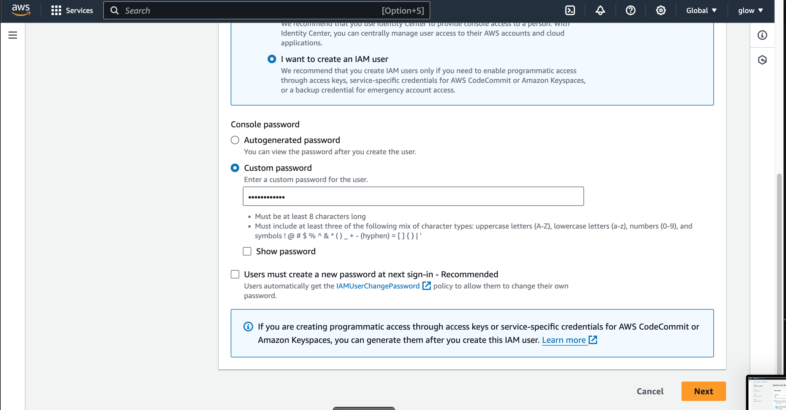

Name : user > assign permission policies > create user group
 

### Create KMS Key

To set up `RDS` we need to create `KMS key` to be used to `encrypt` the database instance
The next step is to create a KMS key in the KMS store
Go to [AWS Key Management service](https://aws.amazon.com/kms/)
create a key > Symmetric

click advance option, leave as default 
name : ACS-rds-key > next

key administartor: set myself > finish

### The next pre requsite is to create a subnet group
    
Go to Amazon RDS service
click on subnet group > Create DB subnet group

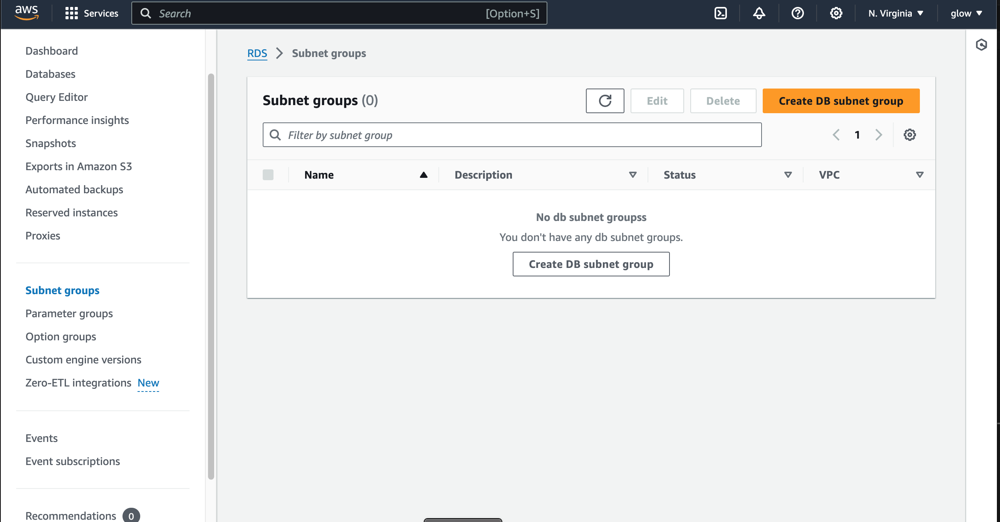

name: ACS-rds-subnet
chose VPC

chose AZ (us-east-1a) and (us-east1b)
**Remember fom the diagram, The RDS are in private subnet 3 and 4**.
**from our design we are using odd numbers for our private subnet**
Our RDS will take (10.0.5.0/24 and 10.0.7.0/24)
Choose the subnets > create
 

### Create Database

Go to dashboard > create database
standard > MySql >(MySQl 8.0.23)

**Choose free Tier**
 

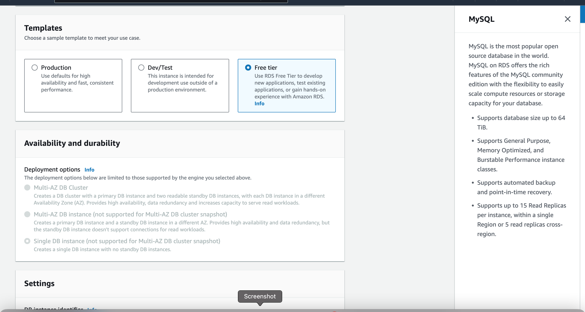

name: ACS-database 
Master Username: change to ACSadmin 
password :admin12345

 

select VPC > the subnet will be automatically populated
public access : NO
       

        - VPC Security group: choose existing (ACS-datalayer)
        - AZ : you can choose between 1a or 1b
        - Database Authentication : Password authentication
        - initial database name: test
        - leave other settings as default > create
        
        

    # To create an autoscaling group we are going to need an AMI, launch template and a target group
    # A target group must be attached to a load balancer
    # we create a target group first, then a lauch template, after the we create the load balancer
    # After that we can create our autoscaling group such that it we make use of the lauch templated and load balancer we've created to spin up our instances
    # 2 things inside lauch template are the AMI and the user data

    # The first thing is to create an AMI first
    # we creating 3 AMI's for (bastion, Nginx and webservers)
        - spin up 3 RedHat EC2 instances for (bastion, Nginx and webservers)
     

    # The first installation is for the Bastion AMI
        - connect to the bastion server via ssh
        - change to super user : su -

        - using the installation.md file for installation
            - install the epel & remi repository
            yum install -y https://dl.fedoraproject.org/pub/epel/epel-release-latest-8.noarch.rpm 
            yum install -y dnf-utils http://rpms.remirepo.net/enterprise/remi-release-8.rpm 

      
            
        
    - install wget vim python3 telnet htop git mysql net-tools chrony -y 
            yum install wget vim python3 telnet htop git mysql net-tools chrony -y 
            

        systemctl start chronyd 
        systemctl enable chronyd
         

# The next installation is for the Nginx AMI
#  we will be configuring sellinux policiies for our nginx
# we will also install sel-signed certificate for our nginx because:
    - To configure our target group, we must ensure that the protocol HTTS on secure TLS port 443 i.e 
    - the load balancer will be sending traffic to both (nginx and webserver on port 443)
    - we must set the port that the nginx is listening to on port 443
    - for this configuration to be secured we must configured a self-signed certificate on (both nginx and webserver instances)
    - Our ALB already have a certficate from AWS manager that we created so our reverse proxy 
# check: tutoria for how to create a self-signed certificate for nginx, also Apache

        - connect to the nginx server via ssh
        - change to super user : sudo su -
        - using the installation.md file for installation
            - install the epel & remi repository
            yum install -y https://dl.fedoraproject.org/pub/epel/epel-release-latest-8.noarch.rpm 
            yum install -y dnf-utils http://rpms.remirepo.net/enterprise/remi-release-8.rpm 
   
            

         - install wget vim python3 telnet htop git mysql net-tools chrony -y 
            yum install wget vim python3 telnet htop git mysql net-tools chrony -y 

         - start and enable chronyd
            systemctl start chronyd 
             systemctl enable chronyd
 

# configure selinux policies for the webservers and nginx servers
        - paste this polices on the terminal
            setsebool -P httpd_can_network_connect=1
            setsebool -P httpd_can_network_connect_db=1
            setsebool -P httpd_execmem=1
            setsebool -P httpd_use_nfs 1
 

# the next step is to install amazon efs utils for mounting the target on the Elastic file system
    - copy these steps and paste to the terminals

            git clone https://github.com/aws/efs-utils
            cd efs-utils
            yum install -y make
            yum install -y rpm-build
            make rpm 
            yum install -y  ./build/amazon-efs-utils*rpm
 
            
            
            

# The next step is seting up self-signed certificate for the nginx instance
    - Paste the steps into the terminal
    - when installing the certificate; on the answering prompt put the following answer
            country : Uk
            province : London
            City : London
            comapny : Olami
            section : Devops
            common name: use the private IPv4 DNS address of the Nginx server
            email: put your email

            sudo mkdir /etc/ssl/private
            sudo chmod 700 /etc/ssl/private
            openssl req -x509 -nodes -days 365 -newkey rsa:2048 -keyout /etc/ssl/private/ACS.key -out /etc/ssl/certs/ACS.crt
            sudo openssl dhparam -out /etc/ssl/certs/dhparam.pem 2048

- To check if the certificate was generated successfully, lets check the parth we save the (certificate and the param)
            - ls -l /etc/ssl/certs/
            - the ACS.crt and param are present
            

- let aslo check for the the key we created
            - ls -l /etc/ssl/private/
            

# The next installation is for the webserver AMI

        - connect to the webserver's server via ssh
        - change to super user : sudo su -
        - using the installation.md file for installation
            - install the epel & remi repository
                yum install -y https://dl.fedoraproject.org/pub/epel/epel-release-latest-8.noarch.rpm 
                yum install -y dnf-utils http://rpms.remirepo.net/enterprise/remi-release-8.rpm 
                
                

        - install wget vim python3 telnet htop git mysql net-tools chrony -y 
                yum install wget vim python3 telnet htop git mysql net-tools chrony -y 
 

        - start and enable chronyd
                systemctl start chronyd 
                systemctl enable chronyd
 

        - configure selinux policies for the webservers and server
            - paste this polices on the terminal
                setsebool -P httpd_can_network_connect=1
                setsebool -P httpd_can_network_connect_db=1
                setsebool -P httpd_execmem=1
                setsebool -P httpd_use_nfs 1

        - the next step is to install amazon efs utils for mounting the target on the Elastic file system
        - copy these steps and paste to the terminals

                git clone https://github.com/aws/efs-utils
                cd efs-utils
                yum install -y make
                yum install -y rpm-build
                make rpm 
                yum install -y  ./build/amazon-efs-utils*rpm

 
                
                
                
        
        - seting up self-signed certificate for the apache webserver instance
                yum install -y mod_ssl
  

                openssl req -newkey rsa:2048 -nodes -keyout /etc/pki/tls/private/ACS.key -x509 -days 365 -out /etc/pki/tls/certs/ACS.crt
  

        - We want to change the path SSLCertificateFile : from localhost to the name we use to generate our certificate and key (ACS) or any name you use in generating your key
                vi /etc/httpd/conf.d/ssl.conf
 

# The next steps is to create image out of our 3 instances (Bastion, webserver and Nginx)
        - go to your instances on the AWS console 
            - For webserver 
                - select  webserver 
                - action > images and template > create image
 

                - Name : ACS-webserver-ami 
                - description: for webserver
                Tag: Name : ACS-webserver-ami 
                create
 
            
             - For bastion 
                - select  bastion
                - action > images and template > create image
  

                - Name : ACS-bastion-ami 
                - description: for webserver
                Tag: Name : ACS-bastion-ami 
                create
  

            - For Nginx 
                - select  nginx
                - action > images and template > create image
  

                - Name : ACS-nginx-ami 
                - description: for webserver
                Tag: Name : ACS-nginx-ami 
                create
  
                

# The next step is to create the Target while the AMI are still pending
# Note we are not creating a target group for the bastion; from our diagram, the bastion is not placed behind the load balancer. 
# we are only creating target group for the instances behind laod balancer which are (Nginx, weservers(tooling & wordpress))
            - Click on Target Groups > create target group
  
            - select instance 
            
            - Target group name : ACS-nginx-target
            
            - protocol : HTTPS :443 (from the documentation)
            - select PVC
            - Health check path: /healthstatus
            - Tag :Name : ACS-nginx-target 
            
            

        - Create another one for wordpress with the same process
        - Name: ACS-wordpress-target
 
        

        - Create another one for tooling with the same process
        - Name ACS-tooling-target
 
            

# The next step is to create our load balancer
    - The first one is the external load balancer
        - click on Load balancer > create load balancer > choose Load balancer
 

        -Name: ACS-ext-ALB
        - internet facing
        - IP address type : IPv4
 

        - choose VPC
        - Mapping : AVailability zone (we need 2 zones) : and our externer load balancer must be in public subnet
            - us-east-1a  - public subnet 1
            - us-east-1b  - public subnet 2
 

        - security group : ACS-ext-ALB
        - Listener : HTTPS (because the target group is on HTTPS)
        - Routing : select ACS-nginx-target (because our external LB is forwarding traffick to nginx )
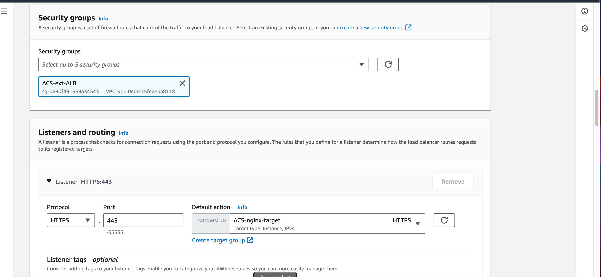

        - certificate type : choose a certificate from ACM, it will automatically chose the certificate name
  
        - >> create
        
        

#  The second one is the internal load balancer
        
        -Name: ACS-int-ALB
        - internet facing
        - IP address type : IPv4
 

        - choose VPC
        - Mapping : AVailability zone (we need 2 zones) : and our internal load balancer is residing in the private sub 1 & 2
            - us-east-1a  - private subnet 1
            - us-east-1b  - private subnet 2

        - security group : ACS-int-ALB
 

        - Listener : HTTPS (because the target group is on HTTPS)
        - Routing : select ACS-wordpress-target (our internal LB is forwarding to both wordpress and tooling, lets use wordpress as default )
 

        - certificate type : choose a certificate from ACM, it will automatically chose the certificate name

        

# To configure our internal load balancer to be routing to tooling
        - select ACS-int-ALB > Listeners > choose the HTTPS:443 > Manage rules > edit rules
 
        

# Because we can configure host header in our nginx reverse proxy server, we can ask our int LB to check for host header.
# and check for tooling.olami.uk and www.tooling.olami.uk
        - Add rules > Tags: tooling > add condition > Host Header
   
        

        - Next
        - forwards to target group: choose ACS-tooling-target > Next
  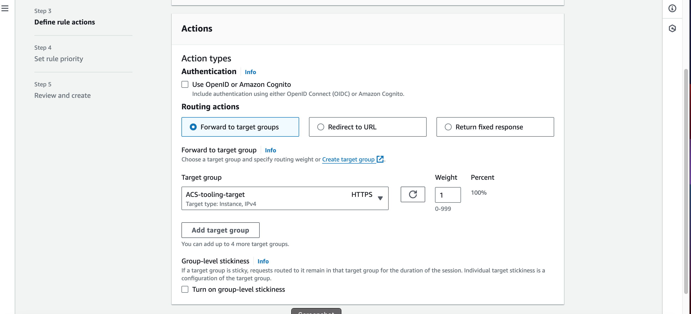

        - rule priority : 10 > next
 

# The next step is to create our lauch template
# for me in case of another proj: take note of the protocol (HTTP or HTTPS )
# go to reverse.conf of the forked repo and read the instruction and make changes before proceeding

# ===========================================================================================================
#    - go to load balancer
#    - select the ACS-int-ALB 
#    - click on details > copy the DNS name
# 
 #   - go to your github repo, the reverse.conf file of the repo you clone i.e  https://github.com/Olaminiyi/ACS-project-config.git 
 #   - under server : update the server name to the name of your domain: *.olami.uk;
 #   - under the proxy_pass, update the address to the DNS name of ACS-int-ALB you copied
 #   - commit the changes
 #   
# ============================================================================================================

# the first launch template will be for the bastion
        - click on launch template > create launch template
 

        - Name : ACS-bastion-template
        - descri- for bastion
 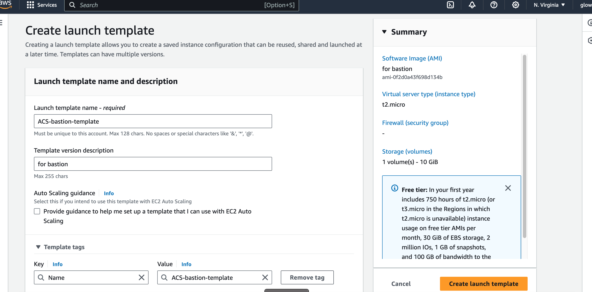

        - Application OS & Image
            - My AMI > owned by me
             - ACS-baston-AMi

        - instant type : t2.micro
        - select key pairs: your key
 

        - Network settings:
            - subnet: either public subnet 1 or 2 (it has to be in public subnet) choose pub 1
            - Advance network configuration
                - security group : ACS-bastion
                - Auto Assign public IP : Enable
 
                

        - on advance details
        - leave as default then go to user data
            - user data:
            #!/bin/bash
            yum install -y mysql
            yum install -y git tmux
            yum install -y ansible

        - create Launch Template

        
        

# The next launch template will be for the nginx
        - click on launch template > create launch template
        
        - Name : ACS-nginx-template
        - descri- for nginx

        - Application OS & Image
            - My AMI > owned by me
             - ACS-nginx-AMi
 

        - instant type : t2.micro
        - select key pairs: your key
 

        - Network settings:
            - subnet: either public subnet 1 or 2 (it has to be in public subnet) choose pub 2
            - Advance network configuration
                - security group : ACS-nginx
                - Auto Assign public IP : Enable

                - Add a tag name;  Name : ACS-nginx-template 
                

        - on advance details
        - leave as default and go to user data
# Read the instruction at the top of nginx-userdata and make changes before you copy it
            - user data:
            ##!/bin/bash
            yum install -y nginx
            systemctl start nginx
            systemctl enable nginx
            git clone https://github.com/Olaminiyi/ACS-project-config.git
            mv /ACS-project-config/reverse.conf /etc/nginx/
            mv /etc/nginx/nginx.conf /etc/nginx/nginx.conf-distro
            cd /etc/nginx/
            touch nginx.conf
            sed -n 'w nginx.conf' reverse.conf
            systemctl restart nginx
            rm -rf reverse.conf
            rm -rf /ACS-project-config
        - create Launch Template
 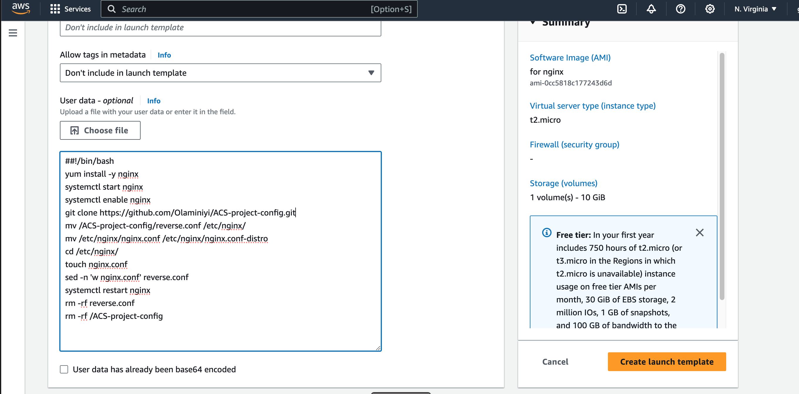

# The next launch template will be for the wordpress
    - Read the instruction in wordpress-userdata first before proceeding

# ===================================================================================================
# for wordpress data, we need to update the mount point to our file system 
#      go to EFS > Access point > select wordpress
# 
#       View details > Attach 
# 

# copy efs mount helper without last efs part
# 
# paste it to replace mount point in wordpress-userdata

# we are creating healthstatus file (empty) so the loadbalancer will see our instance as healthy
# we need to change our rds endpoint
# go to rds > Db instances(1/40) 
# 
# click on acs-database
# 
# copy the endpoint
# 
# paste it between "sed -i "s/localhost/.........../g" wp-config.php " in wordpress-userdata.md file
# note that we have not created wordpressdb on line.., but we are going to create it
# ===========================================================================================================

        - click on launch template > create launch template
        
        - Name : ACS-wordpress-template
        - descri- for wordpress
        - Add Tag: Name : ACS-wordpress-template

        - Application OS & Image
            - My AMI > owned by me
             - ACS-webserver-AMi   (wordpress and tooling are using webserver AMI)

        - instant type : t2.micro
        - select key pairs: your key
      

        - Network settings:
            - subnet: either private subnet 1 or 2 (it has to be in private subnet) choose private 1
            - Advance network configuration
                - security group : ACS-webserver
                - Auto Assign public IP : Disable (if enable it will still not be reachable because is attach to Nat gateway)

                - Add a tag name;  Name : ACS-wordpress-template 
                

        - on advance details
        - leave as default and go to user data

            - user data:
                #!/bin/bash
                mkdir /var/www/
                sudo mount -t efs -o tls,accesspoint=fsap-05cde16db4212f446 fs-07d12dccdc93fa0bd:/ /var/www/
                yum install -y httpd 
                systemctl start httpd
                systemctl enable httpd
                yum module reset php -y
                yum module enable php:remi-7.4 -y
                yum install -y php php-common php-mbstring php-opcache php-intl php-xml php-gd php-curl php-mysqlnd php-fpm php-json
                systemctl start php-fpm
                systemctl enable php-fpm
                wget http://wordpress.org/latest.tar.gz
                tar xzvf latest.tar.gz
                rm -rf latest.tar.gz
                cp wordpress/wp-config-sample.php wordpress/wp-config.php
                mkdir /var/www/html/
                cp -R /wordpress/* /var/www/html/
                cd /var/www/html/
                touch healthstatus
                sed -i "s/localhost/acs-database.cxgqmm0me4bb.us-east-1.rds.amazonaws.com/g" wp-config.php 
                sed -i "s/username_here/ACSadmin/g" wp-config.php 
                sed -i "s/password_here/admin12345/g" wp-config.php 
                sed -i "s/database_name_here/wordpressdb/g" wp-config.php 
                chcon -t httpd_sys_rw_content_t /var/www/html/ -R
                systemctl restart httpd

  
# The next launch template will be for the tooling
        - click on launch template > create launch template
        
        - Name : ACS-tooling-template
        - descri- for tooling
 

        - Application OS & Image
            - My AMI > owned by me
             - ACS-webserver-AMi
       

        - instant type : t2.micro
        - select key pairs: your key
             

        - Network settings:
            - subnet: either private subnet 1 or 2 (it has to be in private subnet) choose private 2
            - Advance network configuration
                - security group : ACS-webserver
                - Auto Assign public IP : Disable
      

                - Add a tag name;  Name : ACS-tooling-template 
                

        - on advance details
        - leave as default and go to user data

- user data:
#!/bin/bash
mkdir /var/www/
sudo mount -t efs -o tls,accesspoint=fsap-0e9251530ad655e9d fs-07d12dccdc93fa0bd:/ /var/www/
yum install -y httpd 
systemctl start httpd
systemctl enable httpd
yum module reset php -y
yum module enable php:remi-7.4 -y
yum install -y php php-common php-mbstring php-opcache php-intl php-xml php-gd php-curl php-mysqlnd php-fpm php-json
systemctl start php-fpm
systemctl enable php-fpm
git clone https://github.com/Olaminiyi/tooling.git
mkdir /var/www/html
cp -R tooling/html/*  /var/www/html/
cd /tooling
mysql -h acs-database.cxgqmm0me4bb.us-east-1.rds.amazonaws.com -u ACSadmin -p toolingdb < tooling-db.sql
cd /var/www/html/
touch healthstatus
sed -i "s/$db = mysqli_connect('mysql.tooling.svc.cluster.local', 'admin', 'admin', 'tooling');/$db = mysqli_connect('acs-database.cxgqmm0me4bb.us-east-1.rds.amazonaws.com', 'ACSadmin', 'admin12345', 'toolingdb');/g" functions.php
chcon -t httpd_sys_rw_content_t /var/www/html/ -R
systemctl restart httpd

# The next step is to create the autoscaling group for the bastion
    - click on Auto Scaling group > create Autoscaling group

    - Name : ACS-bastion
    - select lauch template: ACS-bastion-template > next
 

    - Network
        - select VPC
        - subnet: it has to in the 2 public subnets (1&2)
        - > Next
        

    - No load balancer (our bastion does not have a load balancer)
    - No VPC Lattice service
    

    - Health check : ELB
   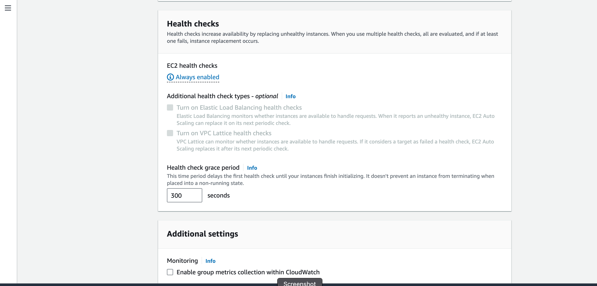 

    - Group size capacity : leave to 1
 

    -Scaling policies
        - select target tracking scaling policy
        - target Value : 90 (in the documentation)
        - > Next
        

    - Add notification
    

        - create a topic : ACS-notification
        - put your email
        -> next 
        
   

    - Add tag: Name: ACS-bastion > Next > create Auto Scaling group

# The next step is to create the Auto Scaling group for the nginx
     - Name : ACS-nginx
    - select lauch template: ACS-nginx-template > next
 

    - Network
        - select VPC
        - subnet: it has to in the 2 public subnets (1&2)
        - > Next
 

    - Attach to an existing load balancer
    - choose from your load balance target group: ACS-nginx-target

    - No VPC Lattice service
    

    - Health check : Turn on ELB
  

    - Group size capacity : leave to 1
 

    -Scaling policies
        - select target tracking scaling policy
        - target Value : 90 (in the documentation)
        - > Next
      

    - Add notification
        - ACS-notification
        -> next 
   

    - Add tag: Name: ACS-bastion > Next > create Auto Scaling group
    

# we can delete the instance we used to create the AMI (webserve, bastion and nginx) as we dont need them again

# The next step is to create the wordpressdb and toolingdb
# we are going to use the concept of ssh agent to achieve this 
    
    - go to EC2 dashboard > select ACS-bastion > copy the public IPv4 addresses
    

    - go to the terminal, add your public key with these commands
        ssh-add <your key>.pem
        ssh-add -l

    - ssh into your bastion with this command
       **** ssh -A ec2-user@<ACS-bastion-public-IPv4-address>   not yet
       - connect normally with public ip
    
    ## if the connection timed out, check the security group and change from my IP to anywhere

    -Let's get into the mysql, we used the RDS endponit as the host
        - Go to RDS > Databases > acs-database >connectivity & Security
        - copy the endpoint
 
        - mysql -h acs-database.cxgqmm0me4bb.us-east-1.rds.amazonaws.com -u ACSadmin -p
            - the password is admin12345
            - create database wordpressdb;
            - create database toolingdb;
            - show databases;
        
            - exit from the RDS and back to our bastion

# The next thing is to create our autoscaling group
- first let's check our target group to check if it's healthy
- go to target group > ACS-nginx-target

- let's creat autoscaling group for wordpress
    - Name : ACS-wordpress
    - select lauch template: ACS-wordpress-template > next
    
    

    - Network
        - select VPC
        - subnet: it has to be in the 2 private subnets (1&2)
        - > Next
 

    - Attach to an existing load balancer
    - choose from your load balance target group: ACS-wordpress-target

    - No VPC Lattice service
    - Health check : Turn on ELB
   

    - Group size capacity : leave to 1
 

    -Scaling policies
        - select target tracking scaling policy
        - target Value : 90 (in the documentation)
        - > Next
      

    - Add notification
        - ACS-notification
        -> next 
   

    - Add tag: Name: ACS-wordpress > Next > create Auto Scaling group
    

# let's creat autoscaling group for tooling
     - Name : ACS-tooling
    - select lauch template: ACS-tooling-template > next
 

    - Network
        - select VPC
        - subnet: it has to be in the 2 private subnets (1&2)
        - > Next
 

    - Attach to an existing load balancer
    - choose from your load balance target group: ACS-tooling-target
     - No VPC Lattice service

    - Health check : Turn on ELB
  

    - Group size capacity : leave to 1
 

    -Scaling policies
        - select target tracking scaling policy
        - target Value : 90 (in the documentation)
        - > Next
      

    - Add notification
        - ACS-notification
        -> next 
   

    - Add tag: Name: ACS-tooling > Next > create Auto Scaling group
    

# All autoscaling group

# Let's create record in our Route53
# We are creating for tooling and wordpress
    - creating for Tooling first
    - go to Route53 > Hosted zone >olami.uk > create Record
 

    - Record name: tooling
    - Alias: toggle on
    -Route traffic : Alias to Application and classic load balancer; 
        - Region: US EAst Virgina
        - select ACS-ext-ALB (external load balancer)

    - Add another record
        - Record name: www.tooling
         - Alias: toggle on
        -Route traffic : Alias to Application and classic load balancer; 
            - Region: US EAst Virgina
            - select ACS-ext-ALB (external load balancer)
            - create

     - let's create record for wordpress
        - Record name: wordpress
        - Alias: toggle on
        -Route traffic : Alias to Application and classic load balancer; 
            - Region: US EAst Virgina
            - select ACS-ext-ALB (external load balancer)
    

    - Add another record
        - Record name: www.wordpress
         - Alias: toggle on
        -Route traffic : Alias to Application and classic load balancer; 
            - Region: US EAst Virgina
            - select ACS-ext-ALB (external load balancer)
            - create
    

# create databases for both tooling and wordpress i.e toolingdb and wordpressdb
- connect to the bastion as ec2-user
    - add your key to the terminal
    - ssh-add proj.pem
    - ssh-add -l (to check if the key has been successfully added)
        - ssh -A ec2-user@44.200.239.37
        - mysql -h acs-database.cxgqmm0me4bb.us-east-1.rds.amazonaws.com -u ACSadmin -padmin12345
        - "create database toolingdb"
        - "create database wordpressdb"
        - create the databases and check them with "show databases;" command
        

# Target groups health checks

# connecting to the websites via the Route53 record name
    - go to Route53 > Hostzone 
    - select tooling.olami.uk > copy the record name and paste it into the brwoser
    - do the same for wordpress.olami.uk

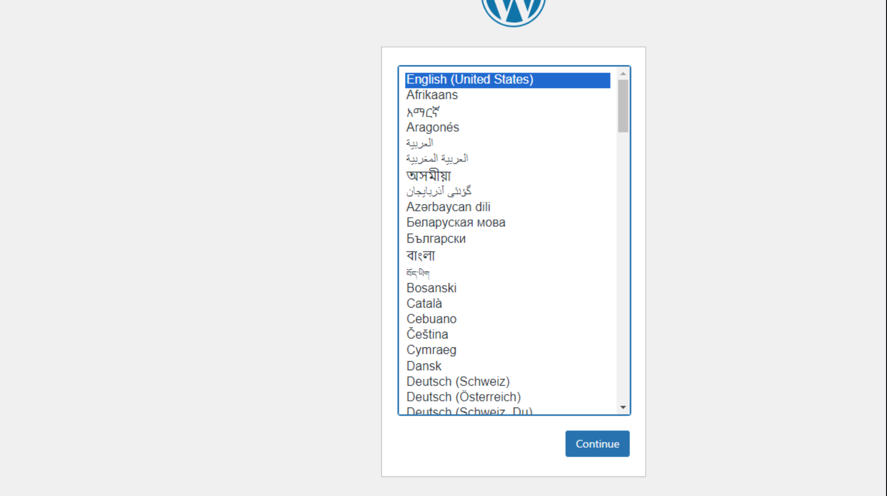

# if the target groups are failing healthcheck, you ssh into their via bastion using their private IP address
# uyou can check if they are mounted properly 
    - df -h
    - ls -l
#  checking for the content in path /var/www/html/
